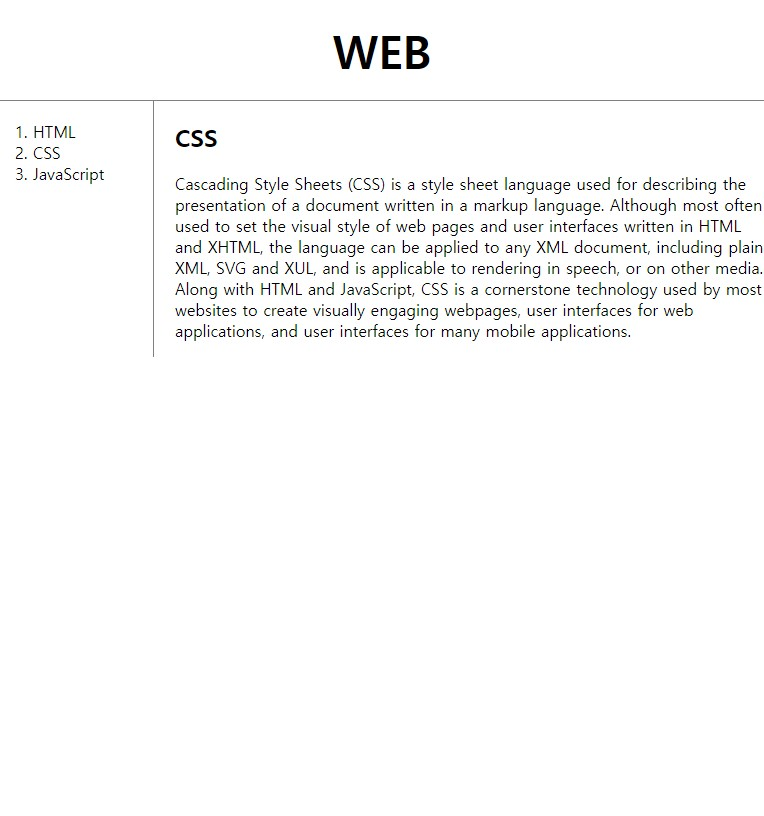

# 2021.09.27(MON) 생활코딩 WEB2-CSS 강의

## WEB2 CSS - 9. 박스 모델 써먹기

### 아래 사진처럼 웹페이지 만들기


```HTML
<!DOCTYPE html>
<html>
    <head>
        <meta charset="utf-8">
        <title>WEB1-Welcome</title>
        <style>
            /* body 태그의 margin을 0으로 주어 웹페이지에 컨텐츠가 꽉 차게 만든 선택자 */
            body {
                margin: 0;
            }
            a {
                color:black;
                text-decoration: none;
            }
            .saw {
                color: gray;
            }
            #active {
                color: red;
            }

            /* h1 태그의 하단선 등에 관련된 선택자 */
            h1  {
                font-size: 45px;
                text-align: center;
                border-bottom: 1px solid gray;
                margin: 0;
                padding: 20px;
            }

            /*ol 태그의 세로선, padding, margin 등에 관련된 선택자*/
            ol {
                border-right: 1px solid gray;
                width: 100px;
                margin: 0;
                padding: 20px;
            }
        </style>
    </head>

    <body>
        <h1><a href="index.html">WEB</a></h1>
        <ol>
            <li><a href="1.html" class="saw">HTML</a></li>
            <li><a href="2.html" class="saw" id="active">CSS</a></li>
            <li><a href="3.html">JavaScript</a></li>
        </ol>

        <h2>CSS</h2>
        <p>
            Cascading Style Sheets (CSS) is a style sheet language used for describing the presentation of a document written in a markup language. Although most often used to set the visual style of web pages and user interfaces written in HTML and XHTML, the language can be applied to any XML document, including plain XML, SVG and XUL, and is applicable to rendering in speech, or on other media. Along with HTML and JavaScript, CSS is a cornerstone technology used by most websites to create visually engaging webpages, user interfaces for web applications, and user interfaces for many mobile applications.
        </p>
```
<br>


### Reference
> https://opentutorials.org/module/3129/18319

<br>


## WEB2 CSS - 10. 그리드 소개

- div tag : 의미도 없고 기능도 없는 태그(태그끼리 묶어줄 때 사용)

```HTML

...
        <style>
...
            #grid {
                display: grid;
                grid-template-columns: 150px 1;
            }
...
        </style>

...

    <body>
        <h1><a href="index.html">WEB</a></h1>
        <div id="grid">
            <ol>
                <li><a href="1.html" class="saw">HTML</a></li>
                <li><a href="2.html" class="saw" id="active">CSS</a></li>
                <li><a href="3.html">JavaScript</a></li>
            </ol>

            <div>
                <h2>CSS</h2>
                <p>
                    Cascading Style Sheets (CSS) is a style sheet language used for describing the presentation of a document written in a markup language. Although most often used to set the visual style of web pages and user 
                    interfaces written in HTML and XHTML, the language can be applied to any XML document, including plain XML, SVG and XUL, and is applicable to rendering in speech, or on other media. Along with HTML and JavaScript, 
                    CSS is a cornerstone technology used by most websites to create visually engaging webpages, user interfaces for web applications, and user interfaces for many mobile applications.
                </p>
            </div>
        </div>
    </body>
</html>
```

```HTML
<style>
...

    #grid {
        display: grid;
        grid-template-columns: 150px 1fr;
</style>

...
```
- grid-template-columns : 첫번째 column(열)은 ol, 두번째 column은 div 태그이다.
- fr : fraction(분수)라는 의미로, 자세한 내용은 [링크](https://blog.sonim1.com/198)를 참고한다.
<br>

```HTML
...

<style>
    #grid ol {
        border-right: 1px solid gray;
        width: 100px;
        margin: 0;
        padding: 20px;
        padding-left: 33px;
    }
</style>

...

<h1><a href="index.html">WEB</a></h1>
        <div id="grid">
            <ol>
                <li><a href="1.html" class="saw">HTML</a></li>
                <li><a href="2.html">CSS</a></li>
                <li><a href="3.html">JavaScript</a></li>
            </ol>

...
```
- #grid ol 선택자 : grid라는 id의 하위 ol 태그를 지칭한다.
<br>

### 최종 이미지


### Reference
> https://opentutorials.org/module/3129/18322