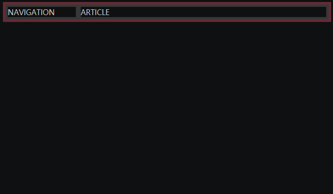
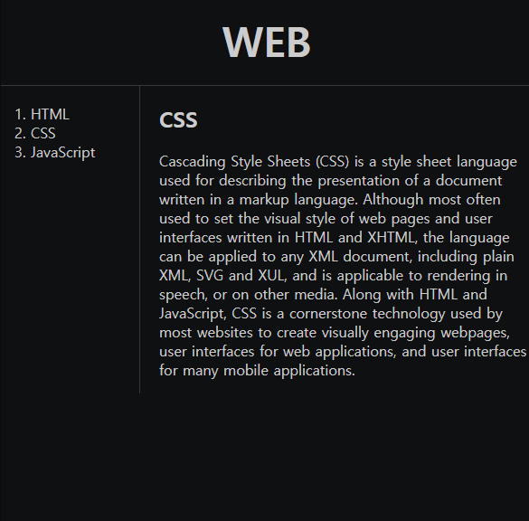
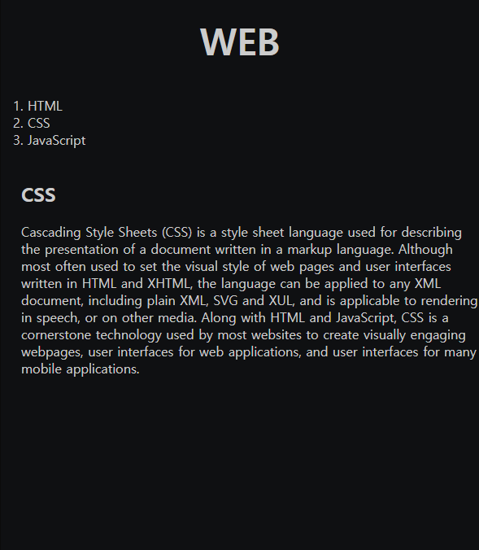

# 2021.09.28(TUE) 생활코딩 WEB2-CSS 강의

## WEB2 CSS - 11. 그리드 써먹기

### 간단 요약
- div 태그 : block level element. 아무 의미없는 태그
- span 태그 : in-line element. 아무 의미없는 태그
- grid-template-columns


```HTML
<!DOCTYPE html>
<html>
    <head>
        <meta charset="utf-8">
        <title></title>

        <style>
            #grid {
                border: 5px solid pink;
                display: grid;
                grid-template-columns: 150px 1fr;
            }
            div {
                border: 5px solid gray;
            }
        </style>
    </head>

    <body>
        <div id="grid">
            <div>NAVIGATION</div>
            <div>ARTICLE</div>
        </div>
    </body>
</html>
```
- grid-template-columns : 첫번째 column(열)은 NAVIGATION(div 태그), 두번째 column은 ARTICLE(div 태그)이다.

- fr : fraction(분수)라는 의미로, 자세한 내용은 [링크](https://blog.sonim1.com/198)를 참고한다.

### 실행 결과



- NAVIGATION column은 150px로 고정되며, ARTICLE column은 1fr로 웹페이지의 크기에 따라 유동적으로 변한다.
<br>

### grid 참고
- grid는 최신 css 기술로 각 브라우저마다 grid를 사용할 수 있는지 알아볼 필요가 있다. 이러한 정보를 쉽게 정리해놓은 사이트가 [caniuse.com](https://caniuse.com/?search=grid)이다.


### Reference
> https://opentutorials.org/module/3129/18322

<br>

## WEB2 CSS - 12. 미디어 쿼리 소개

### 간단 요약
- 반응형 디자인(responsive design)
- media query
<br>


### 전체코드
```CSS
<!DOCTYPE html>
<html>
    <head>
        <meta charset="utf-8">
        <title></title>
        <style>
            div {
                border: 10px solid green;
                font-size: 60px;
            }
            /* screen width > 800px 이면 웹페이지에 아무것도 출력하지 않음 */
            @media(min-width:800px) {
                div {
                    display: none;
                }
            }
        </style>
    </head>

    <body>
        <div>
            Responsive
        </div>
    </body>
</html>
```
<br>


### 세부내용
```CSS
<style>
    div {
        border: 10px solid green;
        font-size: 60px;
    }
    /* screen width > 800px 이면 웹페이지에 아무것도 출력하지 않음 */
    @media(min-width:800px) {
        div {
            display: none;
        }
    }
</style>
```
- @media(min-width: 800px) : width의 최소값이 800px인 범위에서 아무것도 출력하지 않는다. 다시 말해, screen width > 800px이면 웹페이지에 아무것도 출력하지 않는다.

- @media(max-width: 800px) : width의 최대값이 800px인 범위에서 아무것도 출력하지 않는다. 다시 말해, screen width < 800px이면 웹페이지에 아무것도 출력하지 않는다.

### Reference
> https://opentutorials.org/module/3129/18323

<br>

## WEB2 CSS - 13. 미디어 쿼리 써먹기

### 전체 코드
> https://github.com/Jarvis-Geun/WEB2-CSS/blob/main/WEB2-CSS_5.html

```CSS
<style>
    /* screen width < 800px */
    @media(max-width: 800px) {
        #grid {
            display: block;
        }
        #grid ol {
            border-right: none;
        }
        h1 {
            border-bottom: none;
        }
    }
</style>
```
width가 800px보다 작으면,  
1. grid(id)는 block level element로 변한다.
2. grid ol(id)의 오른쪽 실선이 사라진다.
3. h1의 아래 실선이 사라진다.

<br>

### 미디어 쿼리 적용 전

<br>

### 미디어 쿼리 적용 후


### Reference
> https://opentutorials.org/module/3129/18323